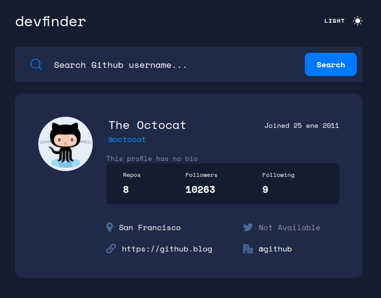
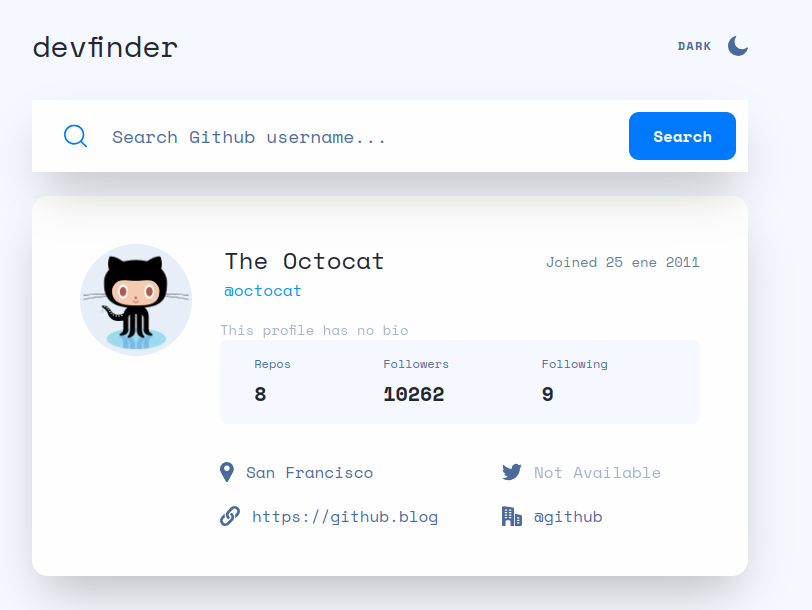

# Frontend Mentor - GitHub user search app solution

This is a solution to the [GitHub user search app challenge on Frontend Mentor](https://www.frontendmentor.io/challenges/github-user-search-app-Q09YOgaH6). Frontend Mentor challenges help you improve your coding skills by building realistic projects.

## Table of contents

- [Overview](#overview)
  - [The challenge](#the-challenge)
  - [Screenshot](#screenshot)
  - [Links](#links)
- [My process](#my-process)
  - [Built with](#built-with)
- [Author](#author)

**Note: Delete this note and update the table of contents based on what sections you keep.**

## Overview

### The challenge

Users should be able to:

- View the optimal layout for the app depending on their device's screen size
- See hover states for all interactive elements on the page
- Search for GitHub users by their username
- See relevant user information based on their search
- Switch between light and dark themes
- **Bonus**: Have the correct color scheme chosen for them based on their computer preferences. _Hint_: Research `prefers-color-scheme` in CSS.

### Screenshot

### Links

- Solution URL: [Code](https://github.com/ReyesRo10/github-user-search)
- Live Site URL: [Demo](https://stellar-raindrop-893457.netlify.app)

## My process

### Built with

- Semantic HTML5 markup
- Flexbox
- Mobile-first workflow
- Fetching data
- Custom hook
- [GitHub users API](https://api.adviceslip.com/) - API for GitHub users data
- [React](https://reactjs.org/) - JS library
- [Tailwind CSS](https://tailwindcss.com/) - For styles
- [Vite](https://vitejs.dev/) - Start Project
- [Netlify](https://www.netlify.com/) - Deploy Project

## Author

- GitHub - [@ReyesRo10](https://github.com/ReyesRo10)
- Frontend Mentor - [@ReyesRo10](https://www.frontendmentor.io/profile/ReyesRo10)
- LinkedIn - [Rodrigo León Reyes](https://www.linkedin.com/in/rodrigoleonreyes/)
